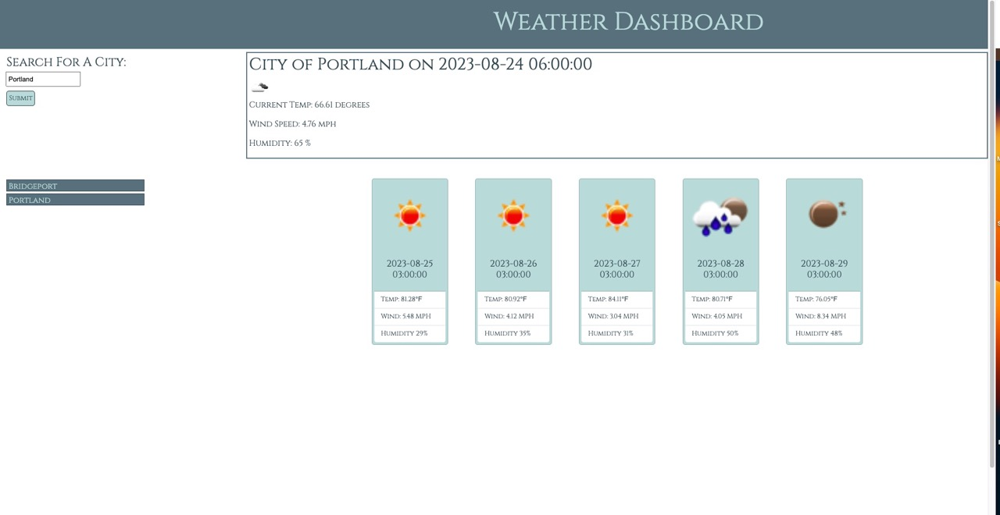

# Weather_Dashboard
Weather dashboard with dynamically updated HTML and CSS

[open weather API](https://openweathermap.org/forecast5)

## Acceptance Criteria
>GIVEN a weather dashboard with form inputs
>WHEN I search for a city,
>THEN I am presented with current and future conditions for that city and that city is added to the search history.

The search box lets the user search any city with autofill available for the most popular cities. most current data according to the weather API (times change depending on day the app is used) are returned in the top box. 5 cards created with bootstrap contain the 5 day forecast. 

>WHEN I view current weather conditions for that city,
>THEN I am presented with the city name, the date, an icon representation of weather conditions, the temperature, the humidity, and the the wind speed.

Everything is refrenced from the JSON returned by the weather API.

>WHEN I view future weather conditions for that city,
>THEN I am presented with a 5-day forecast that displays the date, an icon representation of weather conditions, the temperature, the wind speed, and the humidity.

Explained in the first acceptance criteria.

>WHEN I click on a city in the search history,
>THEN I am again presented with current and future conditions for that city.

an event listener passes the text content of the li through the getWeather function to pull the weather info for that city back up.

## What I Learned

I had alot of fun using the different API"s available. jQuery, jQueryUI, and Bootstrap all made the layout of the page extremely easy and quite quick to code. The weather API was fun to learn to use. I do wish the returned arrays were consistent with times and dates as I do not like how it changes depending on the time of day you use the app. I also would like to lose the timestamp behind the date. If this were for a paying client, I think I would research other weather API's or even what the paid version offers. 

## Final Product

## Deployed Application
[ Weather Dashboard ]( https://torysnopl.github.io/Weather_Dashboard/)

### Source Code
Meyer reset used and cited in the `reset.css`. Libraries used: bootstrap, jQuery, jQueryUI, and Google Fonts. City array created by norcal82 on github. 